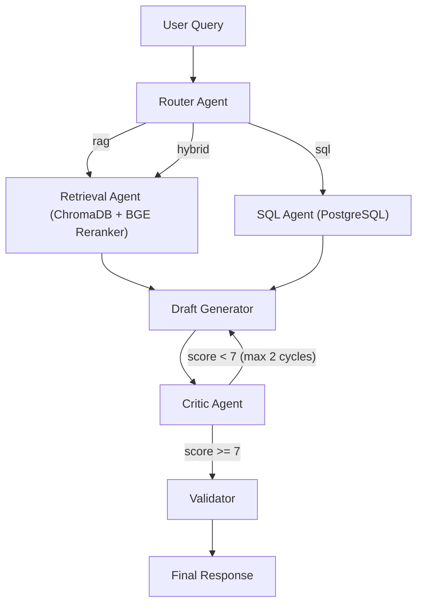

#RegWatcher AI

**A multi-agent pipeline for ingesting, processing, and querying US Federal Register documents using hybrid Semantic Vector Search (RAG) and Relational SQL execution.**

RegWatcher AI fetches thousands of government regulations from the Federal Register API, runs OCR on attached PDFs, stores structured metadata in PostgreSQL and semantic text chunks in ChromaDB, then uses a LangGraph orchestrator with a Router, Retrieval, Draft, Critic, and Validator loop to answer natural language queries.

---

## Architecture



### Key Components

| Component | File | Purpose |
|-----------|------|---------|
| **Router Agent** | `app/agents/router.py` | Classifies queries as `sql`, `rag`, or `hybrid` |
| **Retrieval Agent** | `app/agents/retrieval.py` | Semantic search via ChromaDB + BGE Reranker |
| **SQL Agent** | `app/agents/sql_agent.py` | Natural language to PostgreSQL query generation |
| **Draft Generator** | `app/agents/response_agents.py` | Generates cited responses from retrieved context |
| **Critic Agent** | `app/agents/response_agents.py` | Fact-checks drafts, scores 1-10, detects hallucinations |
| **Validator** | `app/agents/response_agents.py` | Final quality gate before response delivery |
| **Orchestrator** | `app/agents/orchestrator.py` | LangGraph state machine wiring all agents together |
| **Data Pipeline** | `app/ingestion/federal_api.py` | Full ETL: API to JSON to CSV to OCR to PostgreSQL + ChromaDB |
| **Scheduler** | `app/scheduler.py` | APScheduler cron job for daily 2 AM ingestion |
| **FastAPI Server** | `app/main.py` | REST API exposing `/chat` and `/health` endpoints |

---

## Project Structure

```
P1-RegWatcher-AI/
├── app/
│   ├── __init__.py
│   ├── main.py                        # FastAPI server entry point
│   ├── scheduler.py                   # APScheduler daily cron job
│   ├── agents/
│   │   ├── orchestrator.py            # LangGraph state machine
│   │   ├── router.py                  # Query classification agent
│   │   ├── retrieval.py               # ChromaDB + BGE Reranker
│   │   ├── sql_agent.py               # NL to SQL agent
│   │   └── response_agents.py         # Draft, Critic, Validator agents
│   ├── context/
│   │   └── token_budget.py            # Token budget management
│   ├── database/
│   │   └── postgres_manager.py        # PostgreSQL schema and query manager
│   ├── evaluation/
│   │   └── evaluate.py                # Ragas evaluation framework
│   ├── ingestion/
│   │   └── federal_api.py             # Complete data pipeline (ETL)
│   ├── memory/
│   │   └── __init__.py
│   ├── retrieval/
│   │   └── __init__.py
│   └── utils/
│       └── config.py                  # All env-based configuration
├── frontend/                          # React + Vite frontend
│   ├── src/
│   │   └── App.jsx
│   ├── package.json
│   └── vite.config.js
├── data/                              # Created by pipeline at runtime
│   ├── raw/json/YYYY-MM-DD/           # Raw API JSON per document
│   ├── processed/csv/YYYY-MM-DD/      # Date-wise CSVs
│   ├── consolidated/                  # Merged CSVs for DB loading
│   └── chromadb/                      # Vector store persistence
├── tests/
├── .env.example
├── requirements.txt
├── Dockerfile
├── docker-compose.yml
└── railway.json
```

---

## Setup and Installation

### Prerequisites

- **Python 3.10+** (tested with 3.14)
- **Docker and Docker Compose** (for PostgreSQL and Redis)
- **Tesseract OCR** (optional, for scanned PDF text extraction)
- **Node.js 18+** (for the frontend)
- **Groq API Key** (free tier - [console.groq.com](https://console.groq.com))

### Step 1 - Clone and Create Virtual Environment

```bash
cd P1-RegWatcher-AI
python -m venv .venv
```

Activate the virtual environment:

```powershell
# PowerShell (Windows) - run this first if scripts are blocked:
Set-ExecutionPolicy -ExecutionPolicy RemoteSigned -Scope Process
.\.venv\Scripts\Activate.ps1
```

```bash
# macOS / Linux
source .venv/bin/activate
```

### Step 2 - Install Python Dependencies

```bash
pip install -r requirements.txt
```

### Step 3 - Configure Environment Variables

```bash
cp .env.example .env
```

Edit `.env` and fill in your keys:

```env
# Required
GROQ_API_KEY=your_groq_api_key_here

# Optional - LangSmith tracing
LANGCHAIN_TRACING_V2=true
LANGCHAIN_API_KEY=your_langsmith_key

# Database (defaults work with docker-compose)
POSTGRES_USER=regwatcher
POSTGRES_PASSWORD=regpassword
POSTGRES_HOST=localhost
POSTGRES_PORT=5432
POSTGRES_DB=regwatcher_db
```

### Step 4 - Start Infrastructure Services

```bash
docker-compose up -d
```

This starts:
- **PostgreSQL 15** on port `5432`
- **Redis 7** on port `6379`

Verify they're running:
```bash
docker ps
```

---

## Running the Data Pipeline

The data pipeline is the **first thing you must run** - it populates both databases so the agents have data to query.

### Manual Ingestion (Decoupled Pipeline)

The pipeline is split into two phases: **Download** (fast, JSON only) and **Preprocess** (slow, OCR and DB loads).

**Phase 1: Download**
By default, running the script with no arguments downloads the last 3 days of data:
```bash
python -m app.ingestion.federal_api
```
*(Or specify dates: `python -m app.ingestion.federal_api --action download --start-date 2024-01-01 --end-date 2024-01-31`)*

**Phase 2: Preprocess**
Once JSONs are downloaded, run the preprocessing step to build the vector DB and Postgres tables (this filters out documents without abstracts and runs OCR on PDFs):
```bash
python -m app.ingestion.federal_api --action preprocess
```

| Phase | Step | Action | Output |
|-------|------|--------|--------|
| Download | 1 | **Fetch** from Federal Register API | Raw documents in memory |
| Download | 2 | **Save raw JSON** (date-wise) | `data/raw/json/2024-06-15/2024-12345.json` |
| Preprocess | 3 | **Load JSONs** | Loads all JSONs from disk into memory |
| Preprocess | 4 | **Filter** | Drops documents without an abstract |
| Preprocess | 5 | **Save CSV** (date-wise & consolidated) | `data/processed/csv/.../documents.csv` |
| Preprocess | 6 | **OCR + Vectorize** | PDF text to chunks to ChromaDB embeddings |
| Preprocess | 7 | **Load to PostgreSQL** | Consolidated CSVs to Postgres tables |

### Data Folder Structure (created automatically)

```
data/
├── raw/json/
│   ├── 2024-06-15/
│   │   ├── 2024-12345.json        # individual raw API response
│   │   └── 2024-12346.json
│   └── 2024-06-16/
│       └── ...
├── processed/csv/
│   ├── 2024-06-15/
│   │   ├── documents.csv          # 55+ metadata fields
│   │   ├── agencies.csv           # agency lookup table
│   │   └── document_agencies.csv  # many-to-many junction
│   └── 2024-06-16/
│       └── ...
├── consolidated/
│   ├── all_documents.csv          # merged across all dates
│   ├── all_agencies.csv
│   └── all_document_agencies.csv
└── chromadb/                      # vector store persistence
```

### Scheduled Daily Ingestion

To run the pipeline automatically at 2:00 AM daily:

```bash
python -m app.scheduler
```

---

## Running the Application

### Start the Backend (FastAPI)

```bash
python -m app.main
```

Or with uvicorn directly:

```bash
uvicorn app.main:app --host 0.0.0.0 --port 8001 --reload
```

The API will be available at `http://localhost:8001`.

**API Endpoints:**

| Method | Endpoint | Description |
|--------|----------|-------------|
| `GET` | `/health` | Health check |
| `POST` | `/chat` | Send a natural language query to the orchestrator |
| `GET` | `/docs` | Interactive Swagger UI (auto-generated) |

**Example `/chat` request:**

```bash
curl -X POST http://localhost:8001/chat \
  -H "Content-Type: application/json" \
  -d '{"message": "Find recent EPA regulations about air quality"}'
```

**Example response:**

```json
{
  "response": "Based on the Federal Register data...",
  "route": "rag",
  "critic_score": 8,
  "critic_iterations": 1,
  "is_valid": true,
  "validation_issues": [],
  "retrieved_chunks": [...]
}
```

### Start the UI (Streamlit)

A lightweight Streamlit Python UI is included so you can query the system without installing Node.js. With the backend already running, open a new terminal and run:

```bash
pip install streamlit requests
streamlit run streamlit_app.py
```

It will automatically open a chat interface in your default browser.

### Start the Frontend (React + Vite)

If you prefer the React frontend (requires Node.js):

```bash
cd frontend
npm install
npm run dev
```

Open `http://localhost:5173` in your browser.

---

## Evaluation (Ragas)

Run the Ragas evaluation framework to measure pipeline quality:

```bash
python -m app.evaluation.evaluate
```

Metrics computed:
- **Faithfulness** - Are answers grounded in the retrieved context?
- **Answer Relevancy** - Does the answer address the question?
- **Context Precision** - Is the retrieved context relevant?
- **Context Recall** - Does the context cover all needed information?

---

## Docker Deployment

### Build and run the full application:

```bash
docker build -t regwatcher-ai .
docker-compose up -d
docker run -p 8001:8000 --env-file .env regwatcher-ai
```

### Deploy to Railway:

The project includes a `railway.json` configuration. Push to a connected Railway project and it will auto-deploy using the Dockerfile.

---

## Configuration Reference

All configuration is managed via environment variables in `.env` (see `app/utils/config.py`):

| Variable | Default | Description |
|----------|---------|-------------|
| `GROQ_API_KEY` | - | **Required.** Groq API key for LLM inference |
| `LLM_MODEL` | `llama-3.3-70b-versatile` | Groq model to use |
| `EMBEDDING_MODEL` | `all-MiniLM-L6-v2` | HuggingFace sentence transformer |
| `CHROMA_PERSIST_DIR` | `./data/chromadb` | ChromaDB storage path |
| `CHROMA_COLLECTION` | `regulations` | ChromaDB collection name |
| `POSTGRES_USER` | `regwatcher` | PostgreSQL username |
| `POSTGRES_PASSWORD` | `regpassword` | PostgreSQL password |
| `POSTGRES_HOST` | `localhost` | PostgreSQL host |
| `POSTGRES_PORT` | `5432` | PostgreSQL port |
| `POSTGRES_DB` | `regwatcher_db` | PostgreSQL database name |
| `REDIS_URL` | `redis://localhost:6379/0` | Redis connection URL |
| `MAX_CONTEXT_TOKENS` | `6000` | Max tokens for context window |
| `CHUNK_SIZE` | `500` | Text chunk size in characters |
| `CHUNK_OVERLAP` | `50` | Overlap between chunks |
| `MAX_CRITIC_CYCLES` | `2` | Max critic rewrite iterations |
| `MIN_CRITIC_SCORE` | `7` | Minimum score to pass critic |
| `HOST` | `0.0.0.0` | Server bind host |
| `PORT` | `8001` | Server bind port |

---

## Tech Stack

| Category | Technology |
|----------|-----------|
| **Orchestration** | LangGraph (state machines and multi-agent loops) |
| **LLM** | Groq - Llama 3.3 70B Versatile (free tier, 500+ tok/s) |
| **Embeddings** | HuggingFace `all-MiniLM-L6-v2` (local CPU) |
| **Reranker** | BGE Reranker Base (optional, graceful fallback) |
| **Vector DB** | ChromaDB (persistent, local) |
| **Relational DB** | PostgreSQL 15 |
| **Checkpointing** | Redis (with MemorySaver fallback) |
| **API Framework** | FastAPI + Uvicorn |
| **OCR** | PyMuPDF + Tesseract OCR |
| **Data Processing** | Pandas |
| **Evaluation** | Ragas (faithfulness, relevancy, precision, recall) |
| **Scheduling** | APScheduler (daily cron) |
| **Frontend** | React 18 + Vite |
| **Deployment** | Docker + Railway |

---


